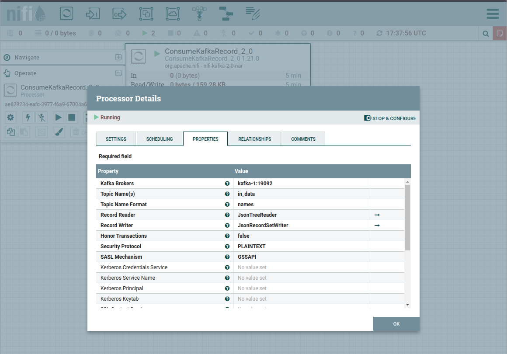

# Реализация заданий 5го модуля
### Реализация задания 1
Кластер Kafka  развернут в Yandex Cloud (будет доступен на время выполнения ревью)
Адреса брокеров (порт 9091):
- rc1d-a8m62cbui79jvek0.mdb.yandexcloud.net
- rc1d-nnr5b4dsg0o4d392.mdb.yandexcloud.net
- rc1d-sss70r2195m2au9f.mdb.yandexcloud.net


Настроен топик `pdata` с `3`-мя партициями и коэф. репликации `3` 


Настроена Schema Registry
Посмотреть доступные схемы можно по адресу https://rc1d-sss70r2195m2au9f.mdb.yandexcloud.net/subjects/pdata-value/versions/latestо в
логин и пароль можно взять из конфигурации продьюсера

для запуска приложения необходимо выполнить `go run cmd/main_cloud.go`

Пример логов
```
{"time":"2025-03-13T08:32:56.838506638+03:00","level":"INFO","msg":"Delivered message ","topic":"pdata","partition":2,"offset":297}
{"time":"2025-03-13T08:32:57.759579848+03:00","level":"INFO","msg":"Received message","value":{"uuid":"ee0b83f7-2a1f-4a1f-b421-360122f209de","from":"Pipa","to":"Goga","content":"Hello! Again?!"}}
{"time":"2025-03-13T08:32:57.761849391+03:00","level":"INFO","msg":"Delivered message ","topic":"pdata","partition":2,"offset":298}
{"time":"2025-03-13T08:32:58.75980529+03:00","level":"INFO","msg":"Received message","value":{"uuid":"94aeccfb-4025-4f6a-8c4f-784a3bd6f453","from":"Pipa","to":"Goga","content":"Hello! Again?!"}}
```

## Реализация задания 2

Реализована обработка сообщений в NiFI

Producer -> NiFiConsumer -> очередь -> NiFiProducer -> Consumer

Для поднятия инфрастуктуры необходимо выполнить `docker compose up -d`
После поднятия кластера необходимо выполнить добавление топиков командой:
```
docker exec -it kafka-1 ../../usr/bin/kafka-topics --create --topic in_data --bootstrap-server localhost:19092 --partitions 3 --replication-factor 2 
docker exec -it kafka-1 ../../usr/bin/kafka-topics --create --topic out_data --bootstrap-server localhost:19092 --partitions 3 --replication-factor 2 
```

NiFi будет доступен по адресу http://localhost:8080/nifi/
Kafka-UI будет доступен по адресу http://localhost:8081/ui/


Для работы нужно импортировать шаблон в NiFi (in_out_pipe1.xml)


После загрузки схема должна выглядеть примерно так:


Настройки прооцессора-консьюмера должны быть следующими:


Настройки процессора-проьюсера должны быть следующими:


Запустить процессоры в NIFI и запустить приложение командой `go run cmd/main.go`

Логи NIFI можно посмотреть в `in_out_logs.log`